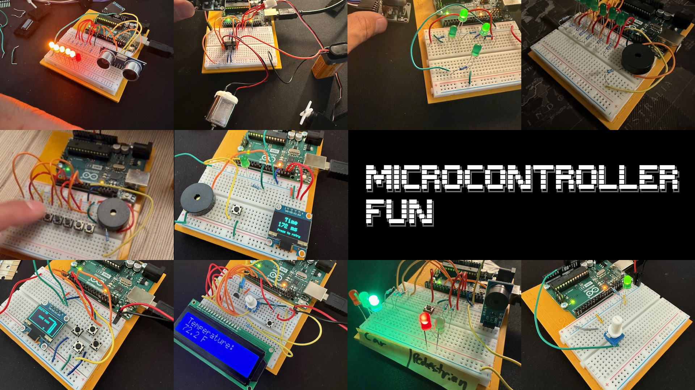

# Microcontroller Fun

A growing collection of Arduino demos I built while learning and experimenting with inputs, outputs, sensors, sound, displays, motors, and simple games.

I started this repo with an Arduino Uno, and I want to eventually explore other microcontrollers as I keep learning.

Each demo lives in its own folder as a separate `.ino` sketch. Most of them include a short setup comment at the top with the parts and wiring.

## Demos

- `variable_led`: Adjust LED brightness with a potentiometer.
- `joystick_simple`: Use a joystick to control four directional LEDs with variable intensity.
- `joystick_servo_and_motor`: Drive a servo for steering and a DC motor for speed and direction with a joystick.
- `distance_as_leds`: Show ultrasonic distance readings on a six-LED bar graph.
- `temperature_display`: Display live temperature readings on a 16x2 LCD and cycle through units with a button.
- `music_lightshow`: Play "Ode to Joy" on a buzzer with matching LED note lights.
- `piano`: Play an 8-key button piano with simple chord support.
- `snake`: Play Snake on a 128x64 OLED using four directional buttons.
- `reaction_timer`: Test reaction speed with an OLED, LED, buzzer, and button.
- `traffic_light_pedestrian`: Simulate a traffic light with a pedestrian crossing button and buzzer.

## Hardware Links

- Arduino Uno starter kit: https://www.amazon.com/dp/B00UET6VJ6
- Additional sensors kit: https://www.amazon.com/dp/B0D3GWJK82
